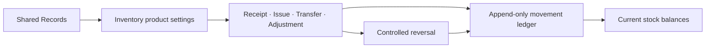

# OneDayOS

OneDayOS is an opinionated, multi-tenant foundation for small-business software. It explores a simple premise: shared business records and organization controls should live in one platform, while focused operational modules build on those contracts instead of recreating them.

> **Status: active build.** Inventory is the first and only implemented business module. The current repository is suitable for engineering review and controlled sandbox walkthroughs after all readiness gates pass; it is not presented as production-ready or as a public self-service demo.

## Current product slice

- **Apps** — a launcher showing only the surfaces available to the signed-in user.
- **Organization** — built-in administration for people, structure, access, and supported settings.
- **Shared Records** — organization-wide Products, Categories, Customers, Suppliers, and Warehouses.
- **Inventory** — the sole business module, covering product settings, stock state, transactions, and the movement ledger.

Apps, Organization, and Shared Records are platform surfaces. They are not additional business modules.

## Inventory workflow

Inventory supports four canonical transaction types:

- Receipts add stock to a destination Warehouse.
- Issues remove stock from a source Warehouse.
- Transfers move stock atomically between Warehouses.
- Adjustments reconcile a Warehouse balance to a verified count.

Every successful post writes the transaction, its lines, append-only Stock Movements, and resulting Stock Balances together. A reversal creates compensating ledger facts rather than editing posted history.



## Technology

- Next.js and React
- TypeScript
- PostgreSQL with Prisma
- Supabase authentication
- Tailwind CSS
- Vitest, Testing Library, and automated accessibility checks

## Run locally

OneDayOS requires Node.js 24 and npm 11.

```bash
npm install
cp .env.example .env.local
npm run dev
```

Configure only a non-production development or sandbox database and Supabase project. Never commit `.env.local` or demo credentials.

The complete local quality gate is:

```bash
npm run check:all
```

Controlled demo setup has additional safeguards and is documented in [`docs/demo/`](docs/demo/). Do not run provision, reset, migration, or cutover commands against an unverified database.

## Deliberate boundaries

This repository does not claim:

- additional business modules;
- public registration or a public reset workflow;
- production operations, monitoring, backup, billing, or abuse controls;
- guaranteed external event delivery;
- representative-user or formal accessibility conformance;
- a currently available public demo.

The narrow scope is intentional: finish one credible Inventory workflow before expanding the platform.
